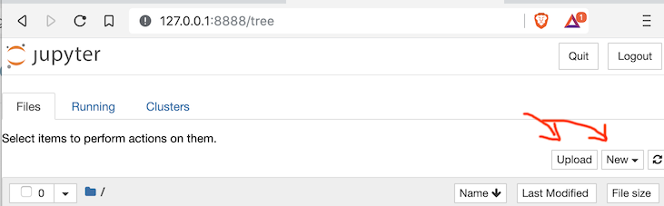

Open your web browser on a notebook server.  You can create a new notebook from scratch, or upload a notebook from your computer:

## Running a notebook server locally

You can run a notebook server locally with docker:

    docker run -it --rm -p 8888:8888 almondsh/almond:0.8.2

If you're more ambitious, you can install a launcher locally:  <https://almond.sh/docs/quick-start-install>

## Using notebooks in a web browser

The files in the `binder` directory define a configuration to use thse notebooks notebooks with `nbviewer` and `mybinder`:

-  notebooks rendered as HTML directly on github: <https://github.com/neelsmith/cite-ipynb/blob/master/almond>
-  formatted display of notebooks on nbviewer: <https://nbviewer.jupyter.org/github/neelsmith/cite-ipynb/tree/master/>
-  work with notebooks interactively  on mybinder.org: 
